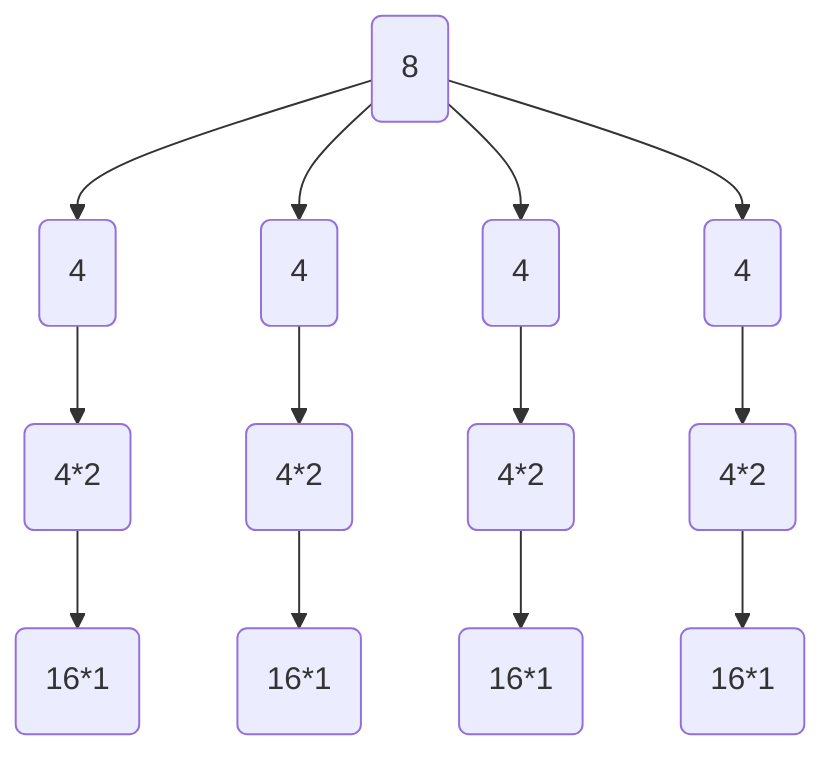

---
tags:
  - foliensatz/02/c
  - "#TODO"
aliases:
  - Mastermethode
---

dramatische musik 

## Mastermethode

Nachdem wir bei [[Merge Sort]] aufwändig die [[Laufzeitanalyse|Laufzeit]] bestimmt haben, wollen wir ein allgemeineres Verfahren finden, um die Laufzeit eines rekursiven Algorithmus' zu finden. 
Wir betrachten dafür die allgemeine Form der Rekursionsgleichung:
$$T(n) = a \cdot T\left(\frac{n}{b}\right) + f(n)$$
mit $T(1) = \Theta(1)$ und $a \geq 1$, $b \gt q$ und $f(n)$ eine asymptotisch positive Funktion ist (also steigt)

Die Interpretation der Gleichung sieht wie folgt aus:
- Das Problem wir in $a$ Teilprobleme der Größe $\frac{n}{b}$ aufgeteilt ($a$ und $b$ können verschieden sein, vielleicht überlappen sich die Teilprobleme oder wir lassen einige Teilprobleme aus)
- Das Lösen jedes der $a$ Teilprobleme benötigt $T\left(\frac{n}{b}\right)$
- Die Funktion $f(n)$ umfasst die Kosten für das Aufteilen und Zusammenfügen

## Mastermethode

Je nachdem, welche Eigenschaft $f(n)$ hat, ergeben sich verschiedene [[Laufzeitanalyse|Laufzeiten]]en $T(n)$:

Seien $a \geq 1$ und $b \gt 1$ Konstanten. Sei $f(n)$ eine positive Funktion und $T(n)$ über den nicht-negativen ganzen Zahlen durch die Rekursionsgleichung 
$$T(n) = a \cdot T\left(\frac{n}{b}\right) + f(n)$$
mit $T(1) = \Theta(1)$
definiert, wobei wir $\frac{n}{b}$ so interpretieren, dass damit entweder $\lfloor \frac{n}{b} \rfloor$ oder $\lceil \frac{n}{b} \rceil$. Dann besitzt $T(n)$ die folgenden asymptotischen Schranken:

1. Gilt $f(n) = \mathcal{O}\left(n^{\log_b (a) - \epsilon}\right)$ für eine Konstante $\epsilon \gt 0$, dann gilt $T(n) = \Theta\left( n^{log_b a} \right)$
2. Gilt $f(n) = \Theta\left(n^{\log_b a}\right)$, dann gilt $T(n) = \Theta \left( n^{\log_b a} \cdot \log_2 n \right)$
3. Gilt $f(n) = \Omega\left(n^{\log_b (a) + \epsilon}\right)$ für eine Konstante $\epsilon \gt 0$ und $af\left(\frac{n}{b}\right) \leq cf(n)$ für eine Konstante $c<1$ und hinreichend große $n$, dann ist $T(n) = \Theta(f(n))$

### Interpretation

1. Ist der Aufwand für das Aufteilen/Zusammenfügen von der Form $cn^x$ mit $x \lt \log_b(a)$, also $\mathcal{O}(n^x)$ (Die $\mathcal{O}$-Notation schluckt den konstanten Faktor $c$), dann wird das Problem ab der Wurzel immer aufwändiger, ist also in der Ebene der Blätter (bzw. Probleme der Größe 1) am komplexesten. Da wir $a^{\log_b n} = n^{\log_b a}$ Blätter je Komplexität $\Theta(1)$ haben, ist die Komplexität des gesamten Problems $\Theta\left(n^{\log_b a}\right)$.
2. Ist der Aufwand $\Theta(f(n)) = \Theta\left(n^{\log_b a}\right)$, also von der Form $\Theta(n^x)$ mit $x = \log_b a$, ändert sich jede Ebene nichts an der Komplexität des Problems. Wir wissen, dass der Rekursionsbaum eine Tiefe $\log_b n$ hat. Wir wissen auch, dass es $n^{\log_b a}$ Blätter mit einer Komplexität von $\Theta(1)$ gibt, also dass die letzte Ebene eine Komplexität von $\Theta\left(n^{\log_b a}\right)$ hat. Da jede der $\log_b n$ Ebenen gleich komplex ist, hat unser Problem eine Gesamtkomplexität von $\Theta\left(n^{\log_b a} \cdot \log_b n\right)$
3. Ist der Aufwand von $f(n)$ polynomiell größer als $n^{\log_b a}$, so wird das Problem ab der Wurzel einfacher. Die Ebene der Wurzel hat somit die größte Komplexität, und der gesamte Algorithmus hat eine [[Laufzeitanalyse|Laufzeit]] $\Theta(f(n))$.

### Beispiel

$a = 4$
$b = 2$
$\log_b a = 2$
Jedes Problem wird also halbiert und vierfach bearbeitet.

Für verschiedene $f(n)$ erhalten wir dann folgenden Aufwand:

| Ebene | $f(n) = n^1$ | $f(n) = n^2$ | $f(n) = n^3$ |
| ----- | ------------ | ------------ | ------------ |
| 0     | 8            | 64           | 512          |
| 1     | 16           | 64           | 256          |
| 2     | 32           | 64           | 128          |
| 3     | 64           | 64           | 64           |

### Grenzen Des Mastertheorems

Es gibt [[Laufzeitanalyse|Laufzeiten]] von $f(n)$, für die das Mastertheorem nicht anwendbar ist:

![[aud_folien_02bc_sorting.pdf#page=66|aud_folien_02bc_sorting, page 66]]

